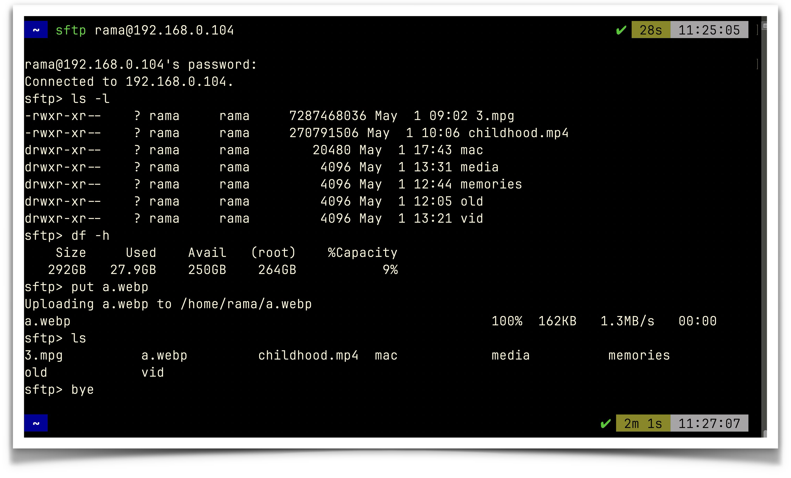

I’ve installed ubuntu server on my old lenovo laptop.

If I want to access via sftp in terminal the commands:

sftp rama@192.168.0.104 (give your ip address after your server name)

- We can even access through a file manager for ease of access. If we have a linux os it'll be free and easy. If we want to access it from mac we need to pay for third party softwares.

- But using terminal we can still access and perform necessary operations. 

## Basic commands
```

put:- for uploading files to server

#To upload a complete folder, first create a folder with the same name then put -r foldername

get:- downloading files from server

bye:- to exit from server.

```

we can access our plex media server through http://192.168.0.118:32400/web.