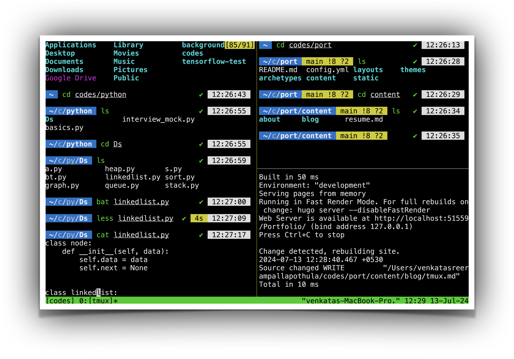

Tmux is a terminal multiplexer that allows us to manage multiple terminal sessions within a single window. all of the commands have prefix Ctrl+b by default. But,I changed ctrl+b to shift+b as it is more accessible.

> - tmux - for new session
> - tmux ls - for list of all the session
> - tmux a -t session name- to enter into a session(t for target)
> - tmux new -s session name- to create a new session (s for session)
> - shift+b d to detach from session
> - shift+b % for vertical panes
> - shift+b “ for horizontal panes
> - shift+b x to close pane
> -  shift+b [ for copying mode & same with ] for pasing, use y to copy (just like in vim) to paste in system clipboard.
> - tmux kill-session- to close a session
> - shift+b Arrow Key (Left, Right, Up, Down) — Move between panes.
> - shift+B C — Create a new window.
> - shift+B N or P — Move to the next or previous window.
> - shift+B 0 (1,2...) — Move to a specific window by number.
> - shift+B ? — View all keybindings. Press Q to exit.

## My tmux config

Often, I use Tmux with keyboard. But when I'm lazy and slouching over on a sofa, it's good idea to have mouse access. We can toggle the mouse on (or off) with the command set -g mouse.

```
set -s escape-time 0
bind -T copy-mode-vi y send-keys -X copy-pipe-and-cancel "pbcopy"

unbind C-b
bind B send-prefix
set-option -g prefix B

set -g mouse on
setw -g mode-keys vi
set -s escape-time 0
set -g default-terminal "screen-256color"
set -ga terminal-overrides ",xterm-256color:Tc"

```
!


I can also customize the status bar(mostly colours) and few other things, but this configuration is more than enough to get the job done for me.